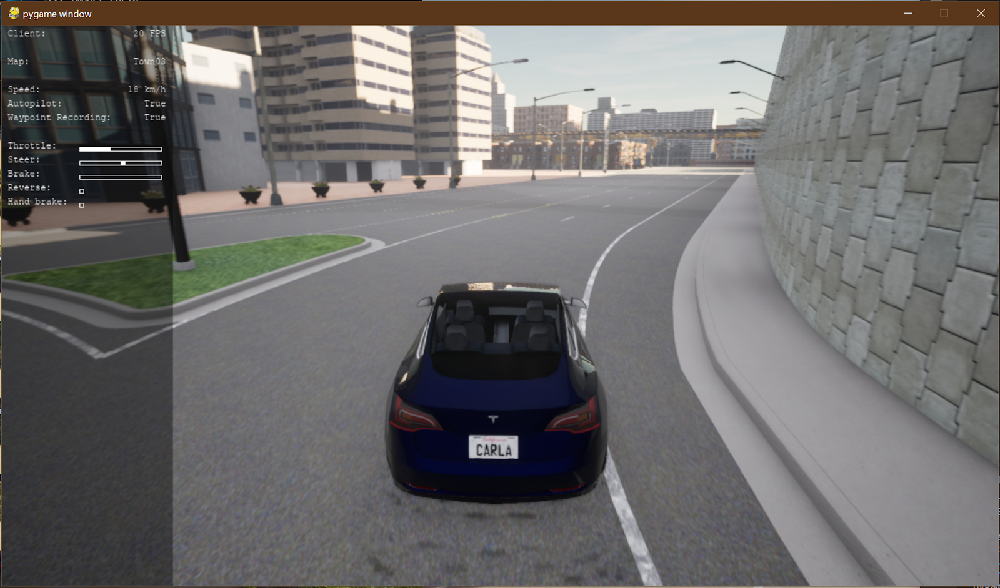
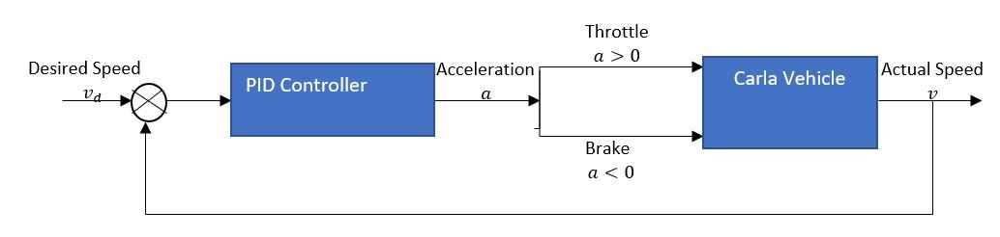
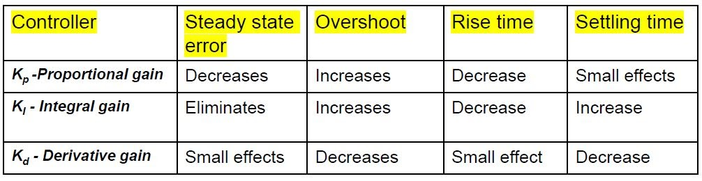
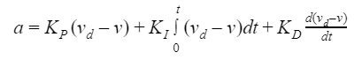
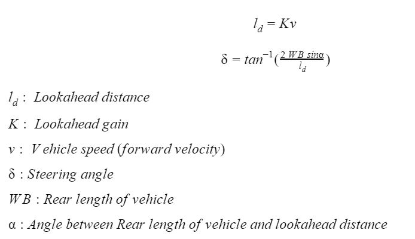
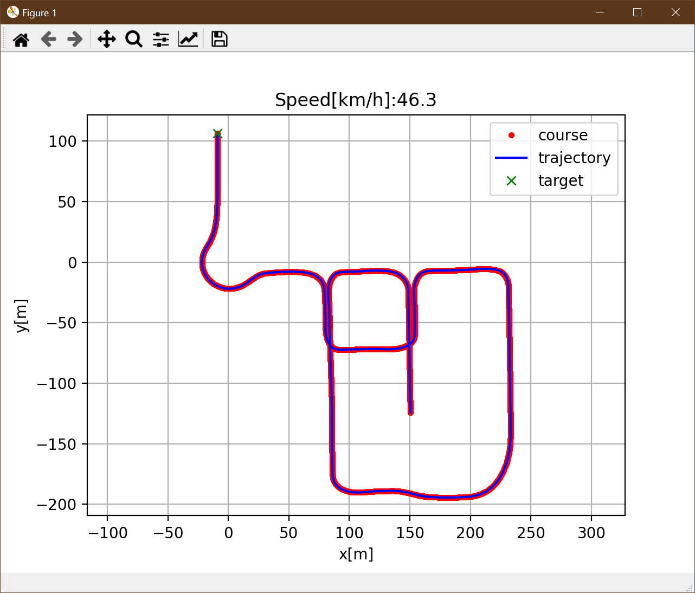
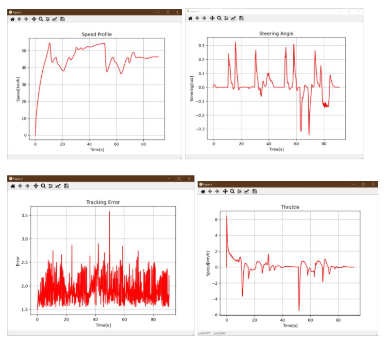

## Self Driving Car (Longitude & Lateral Controllers for Waypoint tracking of a vehicle)


### Dependencies
#### (Important!)
* [Python 3.7](https://www.python.org/downloads/release/python-379/)
* [Carla 0.9.10](https://carla-releases.s3.eu-west-3.amazonaws.com/Windows/CARLA_0.9.10.zip)
* [Matplotlib.pyplot](https://matplotlib.org/users/installing.html)
* [Pandas](https://pandas.pydata.org/pandas-docs/stable/getting_started/install.html)
* [Pygame](https://pypi.org/project/pygame/)
* [Numpy](https://pypi.org/project/numpy/)

#### (Installed with above dependencies)
> [Math](https://docs.python.org/3/library/math.html)
> [Glob](https://docs.python.org/3/library/glob.html)
> [OS](https://docs.python.org/3/library/os.html)
> [Sys](https://docs.python.org/3/library/sys.html)
> [Random](https://docs.python.org/3/library/random.html)
> [Weakref](https://docs.python.org/3/library/weakref.html)


### Files
The project consists of files main.py, controller.py, Test.py, waypoint_generator.py and waypoint_carla.txt. These files are discussed below.

#### 1. _controller.py_
##### Description
controller.py file consists of 2 controllers namely PID and Pure Pursuit. PID controller is responsible for longitudinal control of vehicle while the Pure Pursuit controller controls the vehicle in lateral direction. 

##### Classes

###### Controller():
For the class we use global variables for proportional controller, derivative gain and integral gain for fine tuning controller behaviour. The key methods of the classes are.

1. >**_PID_()**: performs longitudinal control of the vehicle by trying to minimize the error between actual velocity & desired velocity from acquired simulation data. This error is used in computing the throttle needed to catch up with desired values. 
**Throttle = Kp(error) + Kd(error)/dt + Ki(error)dt**
where dt is 0.1sec.
   




2. >**pure_pursuit()**: performs the latitudinal control of the vehicle by calculating steering angle needed to turn towards the desired target waypoint. The steering angle (delta) is calculated as 
**delta = math.atan2((2.0WBxSIN(alpha)), Ld)**
where **alpha** is the angle between the car's rear axle and target waypoint subtracted by car's yaw, **Ld** is the dynamic look ahead distance from TargetCourse(), and **WB** is the length of the rear axle of a car.




###### Notes: 
Proportional, Derivative and Integral gain values can be further tuned. As of now they are set to **_Kp=0.5, Kd=0.1, Ki=0.15_**.

#### 2. _main.py_
##### Description
main.py file contains the main body of code with imports from Test.py and controller.py. Here the acquired waypoints (x,y coords and velocity) are read from a text file and stored as an array. In a while loop, the target waypoint index is calculated using TargetCourse() class, and the waypoint at this index acts as reference targets for the PID and Pure Pursuit controller which output steering and throttle values. The controller outpur is then used to update and store the state variables for the vehicle over time, after which, live plotting is performed. We generate additional plots for better insights of simulation using Test.py() class for tracking error, steering angle, throttle and velocity plots.  



##### Classes

###### State():
The methods in this class updates the state of the vehicle using simple trigonometry based on the controller output of steering angle and throttle at an instance of time over the trajectory course.

###### States():
This class essentially stores the history of state variables as they are updated in State() class over the course of trajectory. The stored data is then accessed for graph plotting or talking back to the CARLA simulator.

###### TargetCourse():
TargetCourse class outputs the index of the target waypoint along the course trajectory that the controller should use as a reference to generate steering and throttle values for. Some important methods are given below.
1. >**search_target_index()**: this method output the index of target waypoint at a set look ahead distance while ensuring that the necessary sanity checks such as the distance from car to the near-future waypoints is not in decreasing order or that the end index of waypoints is not reached. Further, this method calculates and returns the new dynamic look ahead distance as: 
 **lookahead_new = K_look * state.vel + lookahead_dist** 
...where **K_look** is adjustable gain (set to 0.1 here) and **lookahead_dist** is adjustable initial look ahead distance (set to 3m here). This scales up based on velocity of vehicle i.e. if the car is going faster, the look ahead distance is further ahead and vice versa.  

###### Notes: 
Change the file name for reading and simulating different waypoints data text file. 
_line_list = [line.rstrip('\n') for line in open('**waypoint_carla.txt**')]_

#### 3. _test.py_
##### Description
plots.py file consists of multiple plotting methods to offer insight into controller performance.

##### Classes

###### plots():
The key methods of the classes are.

1. >**speed_profile()**:   sets up plot for speed vs time
2. >**tracking_error()**:  sets up plot for tracking error magnitude i.e. sums of square root of lateral and longitudinal controller errors vs time
3. >**look_distance()**:  sets up time plot for look ahead distance dynamically scaled using vehicle velocity
4. >**throttle()**:  sets up plot for PID controller throttle values vs time
5. >**steering()**:  sets up plot for Pure Pursuit controller steering values vs time



#### 4._waypoint_generator.py_

##### Description

Waypoint_generator.py file is used to generate waypoints text file to be used by main.py file. The waypoints text file has location x, y and velocity of vehicle . To generate waypoints, user can either manually drive vehicle around the city or use autopilot. Key ‘r’ is used to start/stop waypoint recording. Key ‘p’ is used to toggle autopilot enable/disable. At every tick, vehicle location and velocity is queried and this data is appended to waypoint.txt file. 


##### Classes

###### world():

World objects are created by the client to have a place for the simulation to happen. The world contains the map,  manages the weather and actors present in it. There can only be one world per simulation, but it can be changed anytime.The methods of this class are:
1. >**start()**:  this method queries carla world for available spawn points of vehicle actor. Then tesla model 3 car is spawned at one of the available spawn points chosen randomly.Then other method is called to initialize CameraManager object and sets up rgb camera sensor.
2. >**tick()**: calls tick method of HUD class to refresh hud variables.
3. >**render()**: Calls CameraManager and HUD object to render frame and display frame.
4. >**append_waypoint()**: calls Waypoint class method to write waypoint data to text file.
5. >**destroy()**: this method destroys the sensors and vehicle created.

###### SimulationDisplay():
This class has a method to display frames at given position and is a parent class to KeyboardControl, HUD class.


###### KeyboardControl():
This class is used to detect keystrokes of keyboard for the purpose of controlling car and setting autopilot, waypoint recording on/off. Class methods are given below:
1. >**parse_events()**: parses events from pygame to detect events like quit, toggle autopilot, waypoint recording, vehicle gear.
2. >**_parse_vehicle_keys()**: it detects keystrokes WASD to control vehicle.
 

###### HUD():

The heads up display is created and rendered every frame using this class. Methods of this class are:
1. >**tick()**: Refresh the HUD variables
2. >**render()**: sets up surface and displays the HUD.

###### CameraManager():
 
This class spawns rgb camera sensor and attached to spawned vehicle at a specific location. The sensor data is decoded and displayed using pygame display at every frame. Methods of this class are:
1. >**set_sensor()**: Spawns rgb camera sensor and attaches  it to created vehicle.
2. >**render()**: renders the frames from camera sensor and displays it.

###### Waypoint():

At each frame, the vehicle location and velocity data is queried. The vehicle velocity magnitude is calculated for x and y direction. This data is appended to the text file created in the format: location.x, location.y, velocity_magnitude forming waypoint. Methods of this class are:
1. >**create_textfile()**: creates a new text file or opens existing text file in append mode.
2. >**print_waypointt()**: writes vehicle location and velocity data to the text file to form waypoints data.


### Compilation Instructions
* Confirm that all required Dependencies are installed
* Open Carla Simulator:
```sh
\> C:
\> cd \"carla_folder_location"\CARLA_0.9.10\WindowsNoEditor\
\> CarlaUE4.exe
```

* Open Python Carla Client and get waypoints either by manually driving using the instructions in waypoint_generator.py file or via automatic control by pressing P to begin automatic driving and R for toggling the recording of waypoint data:
```sh
\> C:
\> cd \"project_folder_location"\Driving-Simulator\
\> python waypoint_generator.py
```

* Move the record waypoint_carla.txt from \"carla_folder_location"\CARLA_0.9.10\WindowsNoEditor\
to \"project_folder_location"\Driving-Simulator\
* Change "name".txt in main.py to match waypoint text file name in the line:
line_list = [line.rstrip(’\n’) for line in open(’filename.txt')]

**Note**: To bypassing data acquisition stage, just run the main.py as shown below for the pre-acquired waypoints stored in waypoint_carla.txt    
* Run main:
```sh
\> C:
\> cd \"project_folder_location"\Driving-Simulator\
\> python main.py
```

#### Executable
* Double click on main.exe to run

**Note**: Executable must be in the same folder as waypoint_carla.txt to run

#### Author
Jonas Chianu

### Collaborators
>Jonas Chianu, 
>Aashkaran Dhillon, 
>Vibhas Vinod Nampalliwar

#### License
This project is licensed under the [MIT](https://badges.mit-license.org/) License.
